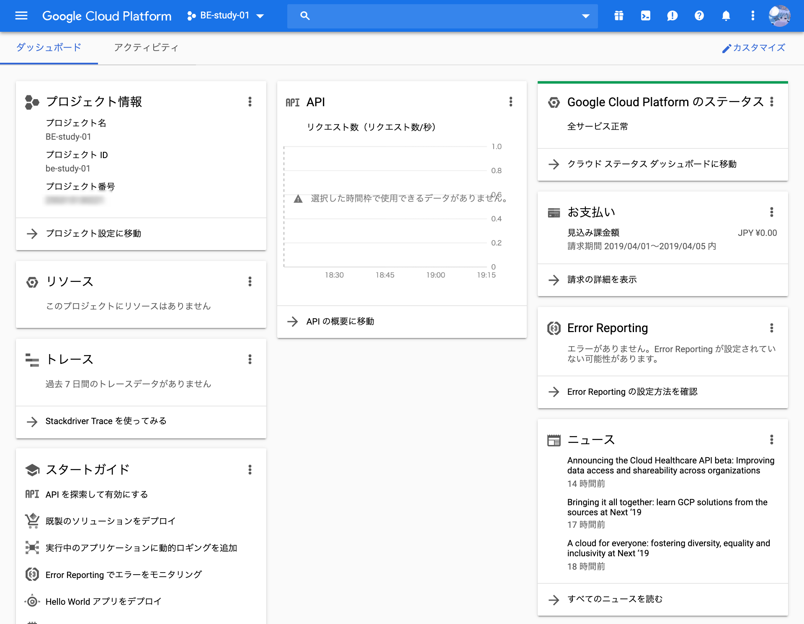
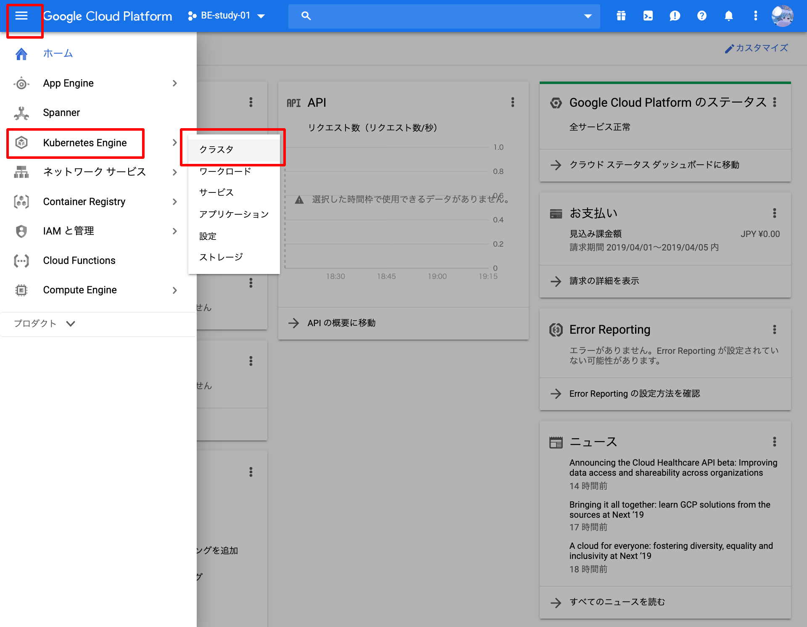
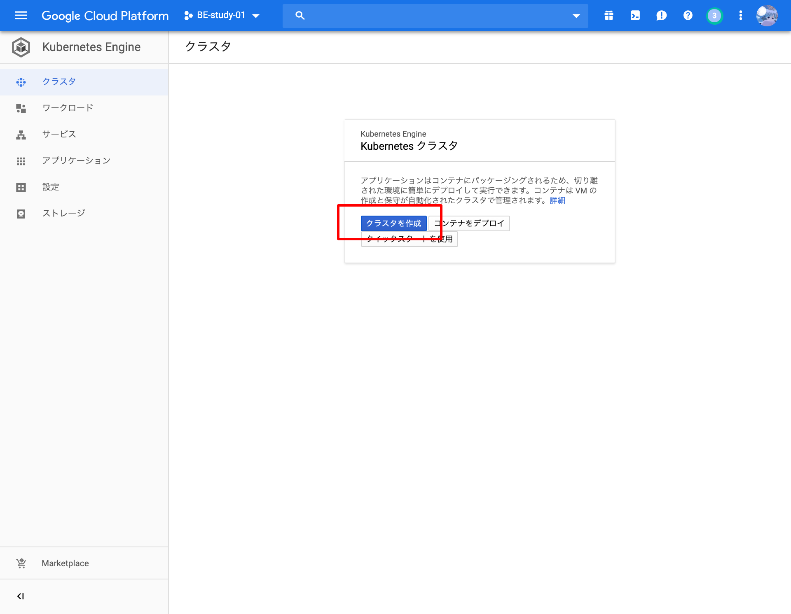
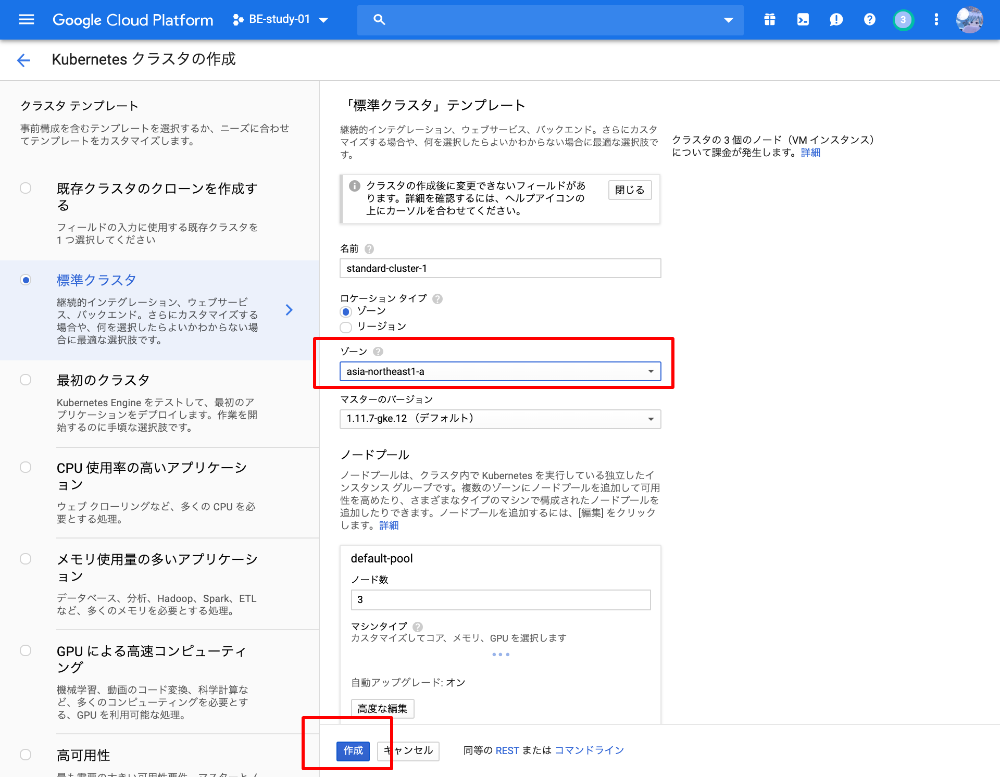
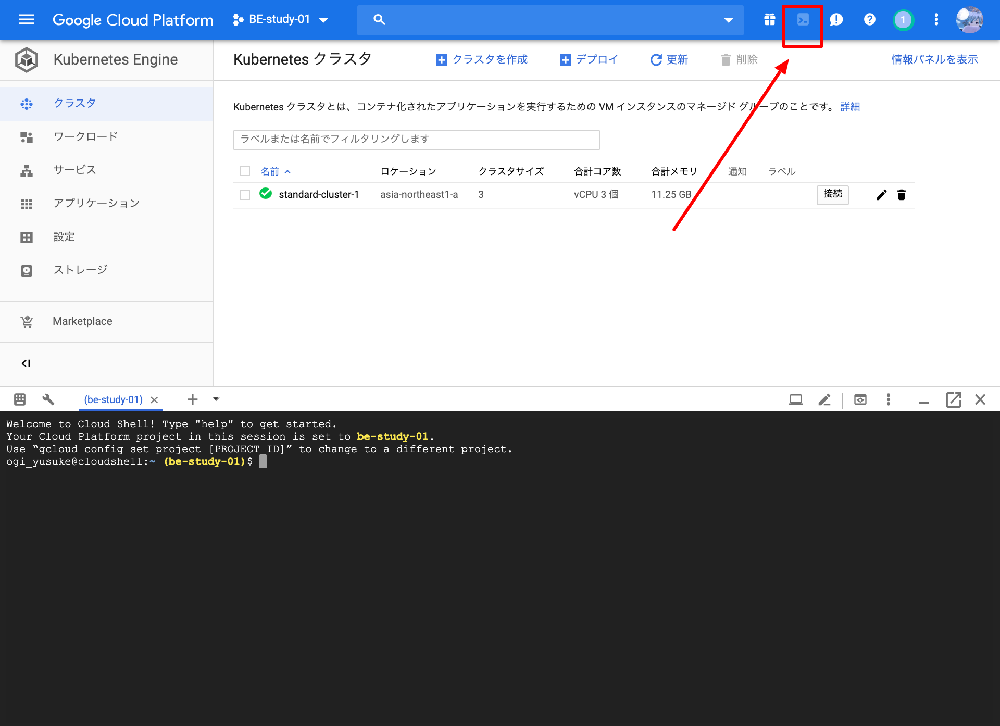

Kubernetesの空気感を知るために、クラスターを立ち上げてシンプルなWebアプリケーションを起動してみましょう。  
上記の図が完成図です。

* GKEクラスターを構築する
* Dockerを起動する
* ロードバランサでリクエストを受ける

## GCPへログイン

[https://console.cloud.google.com/home/dashboard](https://console.cloud.google.com/home/dashboard)

今回はGoogle Cloud Platform のマネージドKubernetesである **"Google Kubernetes Engine"** を使います。  
まずはブラウザでGCPのコンソールを表示しましょう。

## Kubernetesクラスターの作成
Kubernetesのクラスターを作成します。  


GCPコンソールのメニューを展開し、 **"Kubernetes Engine > クラスタ"** を選択します。


GKEを初めて選択する場合はAPIの有効化が必要になります。1分ほど待ちましょう。


**"クラスタの作成"** を選択して作成を開始します。


ゾーンだけ **"asia-northeast-1a"** (東京)に変更します。ゾーンはデータセンターの場所のことです。  
変更後、 **"作成"** を押下します。


GKEの作成は5分ほど必要です。  
ステータスがグリーンになったらKubernetesクラスターの作成完了です！

## CLIからKubernetesを使用する準備
以降、コマンドはGCPコンソールで動かすことができるシェル(Cloud Shell)で操作します。  


Cloud ShellはGCPのヘッダーのボタンを押すことで起動します。  
シェルの立ち上げに3分ほどかかるので少し待ちましょう。


シェルの立ち上げ後、KubernetesをCLI上で操作するための認証情報を取得します。  

```console
$ gcloud container clusters get-credentials standard-cluster-1 --zone asia-northeast1-a
kubeconfig entry generated for standard-cluster-1.
```

認証できているか確認のため、KubernetesをCLIで操作するための `kubectl` コマンドでKubernetes上の現在のObjectsを表示してみます。
```console
$ kubectl get all
NAME                 TYPE        CLUSTER-IP   EXTERNAL-IP   PORT(S)   AGE
service/kubernetes   ClusterIP   10.3.240.1   <none>        443/TCP   10m
```

!!! note "Objects とは"
    Kubernetesを構成するリソースのことを **"Objects"** と呼びます。  
    Dockerコンテナ・ロードバランサ・認証/認可・オートスケール・サービスディスカバリ・セルフヒーリングなど、様々な責務を持ったObjectsが存在します。  
    Objectsは独自に作成することも可能です。  
    非常に機能が多く一気に学ぶと混乱しやすいため、この章ではDeploymentとServiceだけを意識すると良いでしょう。  

