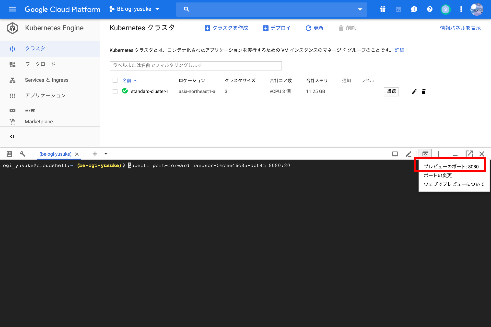

## Dockerを起動する
NginxのDockerイメージをGKE上で起動してみましょう。  

`kubectl create deployment <命名> --image=<Dockerイメージ>` でDockerを起動することができます。  
今回は **"handson"** という名前で **"nginx Dockerイメージ"** を起動してみましょう。  

```console
$ kubectl create deployment handson --image nginx
deployment.apps/handson created
```

現在のKubernetesのObjectsを確認してみます。  

以下のように2行目の"pod/handson-<HASH値\>"の"STATUS"が"Running"の表示になっていることを確認してください。  

```console
$ kubectl get all
NAME                           READY     STATUS    RESTARTS   AGE
pod/handson-57bb9b4684-mgdkl   1/1       Running   0          10s
NAME                 TYPE        CLUSTER-IP   EXTERNAL-IP   PORT(S)   AGE
service/kubernetes   ClusterIP   10.3.240.1   <none>        443/TCP   1h
NAME                      DESIRED   CURRENT   UP-TO-DATE   AVAILABLE   AGE
deployment.apps/handson   1         1         1            1           10s
NAME                                 DESIRED   CURRENT   READY     AGE
replicaset.apps/handson-57bb9b4684   1         1         1         10s
```

## nginxに接続する


Kubernetesはクラスタ内のコンテナをローカルへポートフォワードすることが可能です。  
先程立ち上げたnginxコンテナをローカルから見てみましょう。

`kubectl port-foward` コマンドでポートフォワードを簡単に行なえます。  
以下のコマンドでnginxコンテナの80ポートをローカルの8080へポートフォワードを行ってみましょう。  
`<POD NAME>` は `kubectl get pods` で取得します。

```console
$ kubectl port-forward <POD NAME> 8080:80
```

これでローカルの8080へポートフォワードが行えました。  

gcloudのプレビュー機能を使ってnginxが起動できているか確認してみましょう。



## index.htmlを編集してみる
新しいターミナルを立ち上げて、現在起動しているコンテナの編集を行ってみましょう。  

Kubernetesは起動中のコンテナにコマンドを実行することが可能です。  
実際にbashを立ち上げて、index.htmlを編集してみましょう。

起動中のPodのNAMEを取得します。
```console
$ kubectl get pods
NAME                       READY   STATUS    RESTARTS   AGE
handson-5676646c85-dbt4m   1/1     Running   0          34m
```

`kubectl exec` を行うことで任意のコマンドを実行できます。  
bashコマンドを実行してコンテナの中に入ってみましょう。

```console
$ kubectl exec -it <POD NAME> bash
root@handson-5676646c85-dbt4m:/#
```

index.htmlの存在を確認し、 "hello" という文字列を書き込みます
```console
# ls /usr/share/nginx/html/
50x.html  index.html
# echo "hello" > /usr/share/nginx/html/index.html
```

先程と同様gcloudのプレビュー機能を使ってnginxコンテナへ接続してみましょう。

ブラウザ上で"hello"が確認できたら完了です。

## 自動復旧の確認
Kubernetesの自動復旧機能を確認してみましょう。  

先程作成したPodのNAMEを確認し、削除してみましょう。
```console
$ kubectl get pods
NAME                       READY   STATUS    RESTARTS   AGE
handson-5676646c85-dbt4m   1/1     Running   0          46m
$ kubectl delete pod/handson-5676646c85-dbt4m
pod "handson-5676646c85-dbt4m" deleted
```

podの一覧を確認してみましょう。  
先程削除したはずのnginxコンテナが復活しています。
```console
$ kubectl get pods
NAME                       READY   STATUS    RESTARTS   AGE
handson-5676646c85-vwkxd   1/1     Running   0          7s
```

では、index.htmlはどうなっているでしょうか。  

再度新しく起動されたPodを指定してポートフォワードを実行してみましょう。  
```console
$ kubectl port-forward <POD NAME> 8080:80
```

gcloudのwebプレビューから確認し、編集前のindex.htmlになっていることが確認できるはずです。
