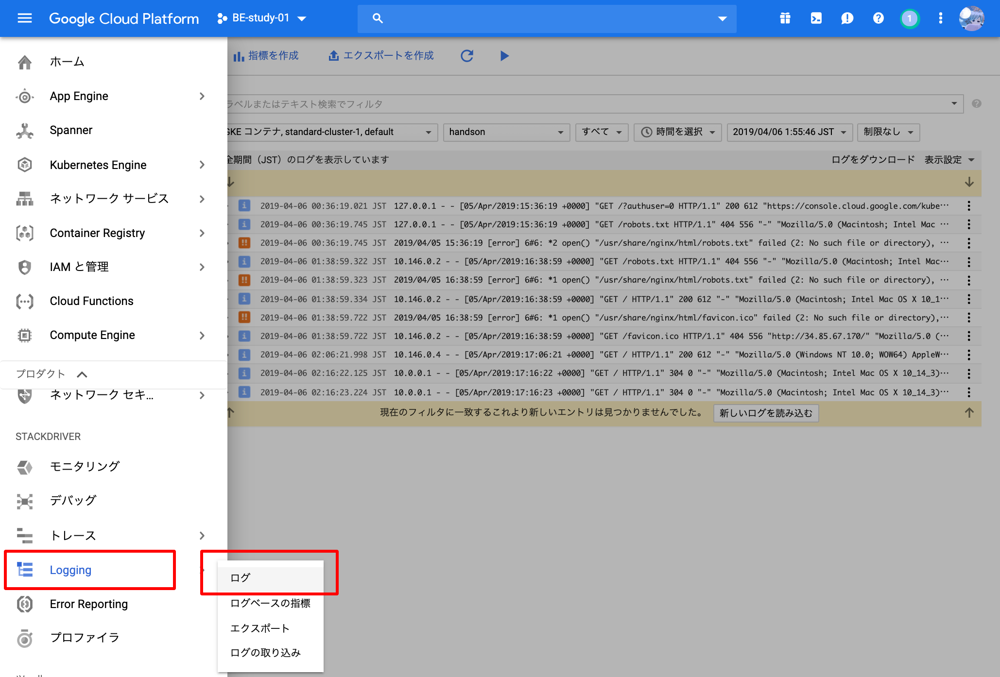
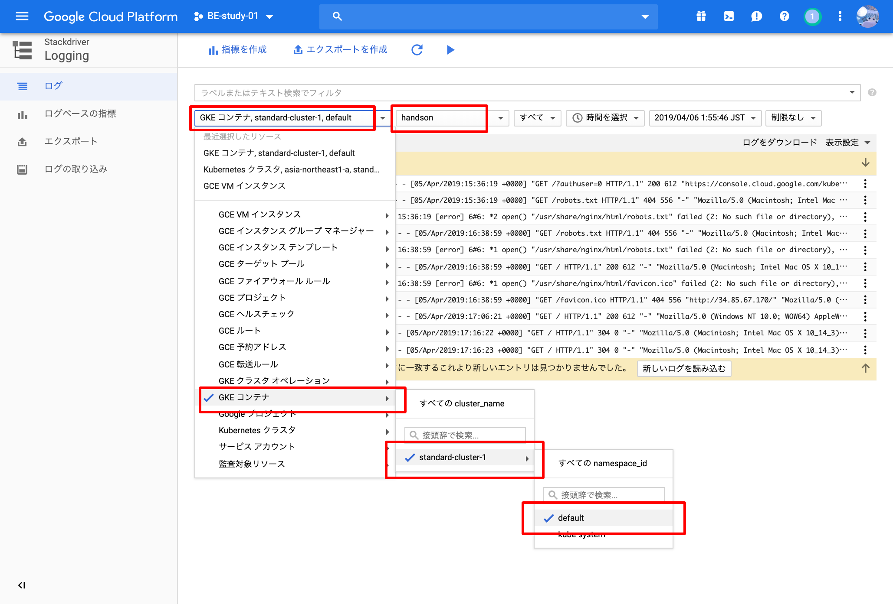

コンテナを外部に公開するためにロードバランサを使用して公開してみましょう。  

GKEはGCPの各種サービスの連携がサポートされています。  
例えばロードバランサはカジュアルにマネージドロードバランサのCloud Load Balancerが使用できます。

## ロードバランサの起動
実際にロードバランサを作成してリクエストを受け付けてみましょう。  
先程作成した"handson"というnginxコンテナへトラフィックを流してみましょう。

`kubectl expose` コマンドでロードバランサを作成することができます。  
以下の通りロードバランサ経由でコンテナにトラフィックを流してみましょう。

```console
$ kubectl expose deploy handson --port=80 --target-port=80 --type=LoadBalancer
service/handson exposed
```

少し待つと、 `service/handson` の "EXTERNAL-IP" が付与されます。  
```console
$ kubectl get all
NAME                           READY     STATUS    RESTARTS   AGE
pod/handson-86f796b8b7-m68sr   1/1       Running   0          4m
NAME                 TYPE           CLUSTER-IP   EXTERNAL-IP    PORT(S)        AGE
service/handson      LoadBalancer   10.3.243.4   34.85.67.170   80:32621/TCP   4m
service/kubernetes   ClusterIP      10.3.240.1   <none>         443/TCP        2h
NAME                      DESIRED   CURRENT   UP-TO-DATE   AVAILABLE   AGE
deployment.apps/handson   1         1         1            1           4m
NAME                                 DESIRED   CURRENT   READY     AGE
replicaset.apps/handson-86f796b8b7   1         1         1         4m
```

表示されたIPへアクセスして、nginxに接続できていることを確認しましょう

## GUIで動作確認
GCPコンソールからKubernetes Objects の詳細を閲覧することができます。  
今回動かした **"handson"** という名前をつけたObjectsがどのように動いているのかGCPコンソール上で見てみましょう。

コンテナの状態の確認  
_( [StackDriver](https://app.google.stackdriver.com) を有効化していないとCPU/Memoryなどのメトリクスは取得できません)_


ロードバランサの確認  


ログの閲覧



