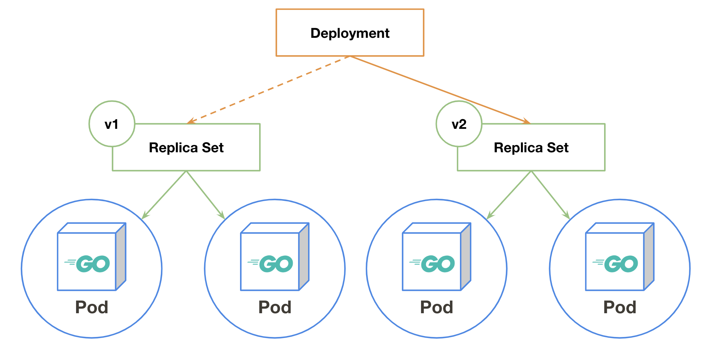
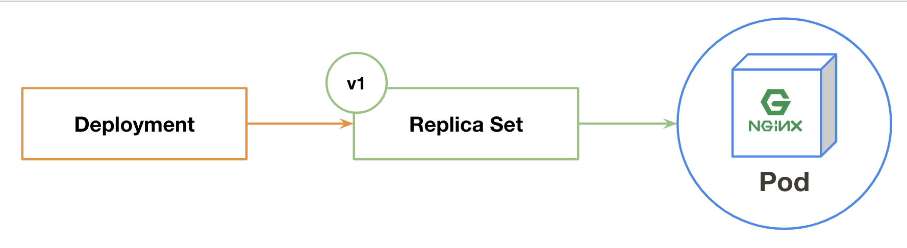
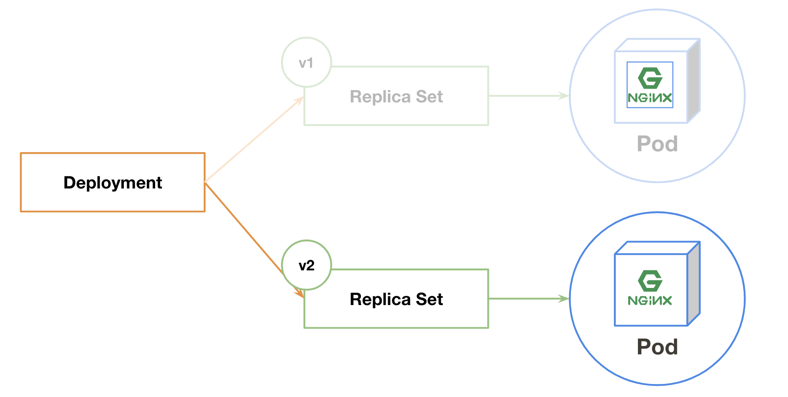

## Deploymentとは
デプロイのためのObjectsです。  
ReplicaSetの世代管理を司ります。

一旦、ここまでの登場人物たちをまとめてみましょう。

- Pod
    - 1つ以上のコンテナを実行する環境
- ReplicaSet
    - Podを指定した台数分維持する
- Deployment
    - ReplicaSetの世代管理

## 実際に動かしてみる
ここでは `nginx:1.16` イメージを起動し、 `nginx:1.17` へアップデートを行ってみましょう

### Deploymentでコンテナを動かす
まずはDeploymentを作成します。  
```console
$ kubectl create deployment mynginx --image nginx:1.16
deployment.apps/mynginx created
```

作成されたObjectsを見てみましょう。
```console
$ kubectl get deployment,replicaset,pod
NAME                            DESIRED   CURRENT   UP-TO-DATE   AVAILABLE   AGE
deployment.extensions/mynginx   1         1         1            1           37s

NAME                                      DESIRED   CURRENT   READY   AGE
replicaset.extensions/mynginx-5559c9b58   1         1         1       38s

NAME                          READY   STATUS    RESTARTS   AGE
pod/mynginx-5559c9b58-rzrcc   1/1     Running   0          38s
```

現在は以下の図のような状態になっています。  
DeploymentがReplicaSetを管理し、ReplicaSetがPodを管理しています。  



### バージョンアップ


ここでは `nginx:1.16` イメージを起動し、 `nginx:1.17` へアップデートを行ってみましょう

まず、現在のdeploymentのイメージが `nginx:1.16` であることを確認します。
```console
$ kubectl get deploy mynginx -o yaml | grep "image:"
      - image: nginx:1.16
```

確認したDeploymentのイメージを `kubectl set` コマンドを使用して `nginx:1.17` へ変更します
```console
$ kubectl set image deploy mynginx nginx=nginx:1.17
deployment.extensions/mynginx image updated
```

Podが代替わりしたことと、Deploymentが指定しているイメージを確認しましょう。
```console
$ kubectl get pods
NAME                       READY   STATUS        RESTARTS   AGE
mynginx-5559c9b58-rzrcc    1/1     Terminating   0          18m
mynginx-84fc57c5f9-6mst8   1/1     Running       0          5s
$ kubectl get deploy mynginx -o yaml | grep "- image:"
      - image: nginx:1.17
```

### ロールバックする
DeploymentはReplicaSetの世代管理を行っています。  
先程 `kubectl set` で行った更新も1世代として記録されています。確認してみましょう。
```console
$ kubectl rollout history deploy mynginx
deployment.extensions/mynginx
REVISION  CHANGE-CAUSE
1         <none>
2         <none>
```

2世代存在することが確認できました。  
1世代目は `kubectl run` で新規作成した際に、2世代目は `kubectl set` でイメージを更新した際のものです。  

それぞれのの世代の詳細は以下のように `--revision` オプションを使うことで確認できます。

```console
$ kubectl rollout history deploy mynginx --revision 1
deployment.extensions/mynginx with revision #1
Pod Template:
  Labels:       app=mynginx
        pod-template-hash=5559c9b58
  Containers:
   nginx:
    Image:      nginx:1.16
    Port:       <none>
    Host Port:  <none>
    Environment:        <none>
    Mounts:     <none>
  Volumes:      <none>
```

```console
$ kubectl rollout history deploy mynginx --revision 2
deployment.extensions/mynginx with revision #2
Pod Template:
  Labels:       app=mynginx
        pod-template-hash=84fc57c5f9
  Containers:
   nginx:
    Image:      nginx:1.17
    Port:       <none>
    Host Port:  <none>
    Environment:        <none>
    Mounts:     <none>
  Volumes:      <none>
```

では、第一世代( `nginx:1.17` )から第二世代( `nginx:1.16` )へロールバックを行ってみましょう。  
`kubectl rollout undo` コマンドを使用して第一世代へ戻ってみます。
```console
$ kubectl rollout undo deploy mynginx --to-revision 1
deployment.extensions/mynginx
```

deploymentの状態を確認すると `nginx:1.16` になっていますね。
```console
$ kubectl get deploy mynginx -o yaml | grep "- image:"
      - image: nginx:1.16
```

`kubectl rollout history` を確認すると第一世代が消えて第三世代になっています。  

```console
$ kubectl rollout history deploy mynginx
deployment.extensions/mynginx
REVISION  CHANGE-CAUSE
2         <none>
3         <none>
```

第一世代と同じく `nginx:1.16` が使用されていることが確認できます。
```console
$ kubectl rollout history deploy mynginx --revision 3
deployment.extensions/mynginx with revision #3
Pod Template:
  Labels:       app=mynginx
        pod-template-hash=5559c9b58
  Containers:
   nginx:
    Image:      nginx:1.16
    Port:       <none>
    Host Port:  <none>
    Environment:        <none>
    Mounts:     <none>
  Volumes:      <none>
```

## お片付け
```console
$ kubectl delete deployment mynginx
```

## 参照
- [Deployments - Kubernetes](https://kubernetes.io/docs/concepts/workloads/controllers/deployment/)
- [Deployment  |  Kubernetes Engine Documentation  |  Google Cloud](https://cloud.google.com/kubernetes-engine/docs/concepts/deployment)
