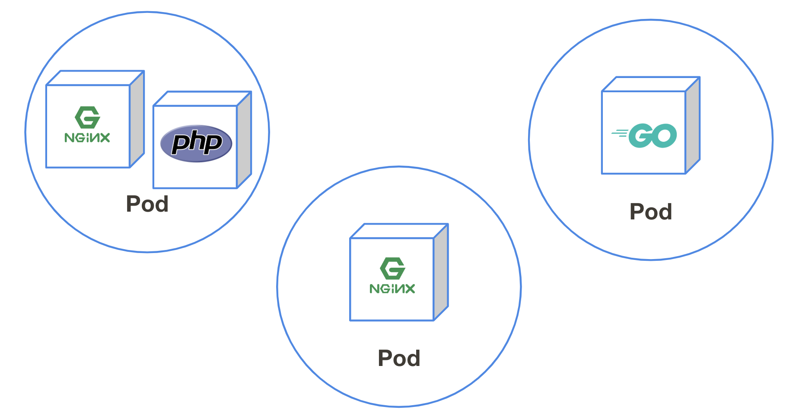

## Podとは
1つ以上のコンテナグループのことPodと呼びます。  

Kubernetesはコンテナを直接管理するのではなく、Podを介してコンテナを管理します。

## 実際にPodを動かしてみる
nginxイメージをKubernetes上で動かしてみましょう。  
以下のコマンドでmynginxという名前をつけたnginxコンテナを実行します。
```console
$ kubectl run mynginx --image nginx --restart Never
pod/mynginx created
```

podが起動されたか確認してみましょう。  
`kubectl get pod` と実行することで現在起動しているpodの一覧を見ることができます。
```console
$ kubectl get pods
NAME      READY   STATUS    RESTARTS   AGE
mynginx   1/1     Running   0          17s
```

"mynginx"というpodが動いているのが見えましたね。  

## 動作確認
nginxが動作しているかアクセスして確認してみましょう。  
同様にポートフォワードを行ってローカルから確認を行います。  
```console
$ kubectl port-forward pod/mynginx 8080:80
Forwarding from 127.0.0.1:8080 -> 80
```

次にCloudShellのwebプレビュー機能でnginxのトップページが確認できれば成功です。

確認できたらポートフォワードを `Ctrl` + `c` で終了しましょう。

## ログの確認
Kubernetesはコンテナの標準出力を閲覧する事が可能です。  
先程アクセスしたnginxの標準出力を確認してみましょう、アクセスログが見えるはずです。
```console
$ kubectl logs pod/mynginx
127.0.0.1 - - [12/Jul/2019:07:04:16 +0000] "GET /?authuser=0 HTTP/1.1" 200 612 "https://console.cloud.google.com/cloudshell/environment/view?project=be-ogi-yusuke" "Mozilla/5.0 (Macintosh; Intel Mac OS X 10_14_5) AppleWebKit/537.36 (KHTML, like Gecko) Chrome/75.0.3770.100 Safari/537.36" "111.108.92.1, 172.217.26.52"
127.0.0.1 - - [12/Jul/2019:07:04:17 +0000] "GET /robots.txt HTTP/1.1" 404 555 "-" "Mozilla/5.0 (Macintosh; Intel Mac OS X 10_14_5) AppleWebKit/537.36 (KHTML, like Gecko) Chrome/75.0.3770.100 Safari/537.36" "111.108.92.1, 172.217.26.52"
2019/07/12 07:04:17 [error] 6#6: *2 open() "/usr/share/nginx/html/robots.txt" failed (2: No such file or directory), client: 127.0.0.1, server: localhost, request: "GET /robots.txt HTTP/1.1", host: "127.0.0.1:8080"
127.0.0.1 - - [12/Jul/2019:07:04:17 +0000] "GET /favicon.ico HTTP/1.1" 404 555 "https://8080-dot-3725049-dot-devshell.appspot.com/?authuser=0" "Mozilla/5.0 (Macintosh; Intel Mac OS X 10_14_5) AppleWebKit/537.36 (KHTML, like Gecko) Chrome/75.0.3770.100 Safari/537.36" "111.108.92.1, 172.217.26.52"
2019/07/12 07:04:17 [error] 6#6: *3 open() "/usr/share/nginx/html/favicon.ico" failed (2: No such file or directory), client: 127.0.0.1, server: localhost, request: "GET /favicon.ico HTTP/1.1", host: "127.0.0.1:8080", referrer: "https://8080-dot-3725049-dot-devshell.appspot.com/?authuser=0"
```

## より詳細な情報を知るには
`kubectl get pods` で現在起動されているpodを確認することがわかりましたが、  
どんなコンテナがどんな設定で動いているのかの情報がこれだけだと少ないですね。
```console
$ kubectl get pods
NAME      READY   STATUS    RESTARTS   AGE
mynginx   1/1     Running   0          28m
```

詳細な情報を知りたい場合は `kubectl describe` コマンドを使うと良いでしょう。  
以下のように現在起動しているコンテナのIPやイメージID、Events（いつ起動したか・異常終了した場合はその理由）を表示することができます。
```console
$ kubectl describe pod mynginx
Name:               mynginx
Namespace:          default
Priority:           0
PriorityClassName:  <none>
Node:               gke-standard-cluster-1-default-pool-0423aa15-rbfv/10.146.0.18
Start Time:         Fri, 12 Jul 2019 15:37:34 +0900
Labels:             run=mynginx
Annotations:        kubernetes.io/limit-ranger: LimitRanger plugin set: cpu request for container mynginx
Status:             Running
IP:                 10.0.2.7
Containers:
  mynginx:
    Container ID:   docker://d77f313b33bff623d59f3f8c86869c1797ed9b8f28c7e54bd953e583cd204e54
    Image:          nginx
    Image ID:       docker-pullable://nginx@sha256:00be67d6ba53d5318cd91c57771530f5251cfbe028b7be2c4b70526f988cfc9f
    Port:           <none>
    Host Port:      <none>
    State:          Running
      Started:      Fri, 12 Jul 2019 15:37:35 +0900
    Ready:          True
    Restart Count:  0
    Requests:
      cpu:        100m
    Environment:  <none>
    Mounts:
      /var/run/secrets/kubernetes.io/serviceaccount from default-token-mcw4s (ro)
Conditions:
  Type              Status
  Initialized       True
  Ready             True
  ContainersReady   True
  PodScheduled      True
Volumes:
  default-token-mcw4s:
    Type:        Secret (a volume populated by a Secret)
    SecretName:  default-token-mcw4s
    Optional:    false
QoS Class:       Burstable
Node-Selectors:  <none>
Tolerations:     node.kubernetes.io/not-ready:NoExecute for 300s
                 node.kubernetes.io/unreachable:NoExecute for 300s
Events:
  Type    Reason     Age   From                                                        Message
  ----    ------     ----  ----                                                        -------
  Normal  Scheduled  32m   default-scheduler                                           Successfully assigned default/mynginx to gke-standard-cluster-1-default-pool-0423aa15-rbfv
  Normal  Pulling    32m   kubelet, gke-standard-cluster-1-default-pool-0423aa15-rbfv  pulling image "nginx"
  Normal  Pulled     32m   kubelet, gke-standard-cluster-1-default-pool-0423aa15-rbfv  Successfully pulled image "nginx"
  Normal  Created    32m   kubelet, gke-standard-cluster-1-default-pool-0423aa15-rbfv  Created container
  Normal  Started    32m   kubelet, gke-standard-cluster-1-default-pool-0423aa15-rbfv  Started container
```

現在起動しているPodをyamlで表示することも可能です。
```console
$ kubectl get pods mynginx -o yaml
apiVersion: v1
kind: Pod
metadata:
  annotations:
    kubernetes.io/limit-ranger: 'LimitRanger plugin set: cpu request for container
      mynginx'
  creationTimestamp: 2019-07-12T06:37:34Z
  labels:
    run: mynginx
  name: mynginx
  namespace: default
  :
```

## お片付け
```console
$ kubectl delete pod mynginx
```
