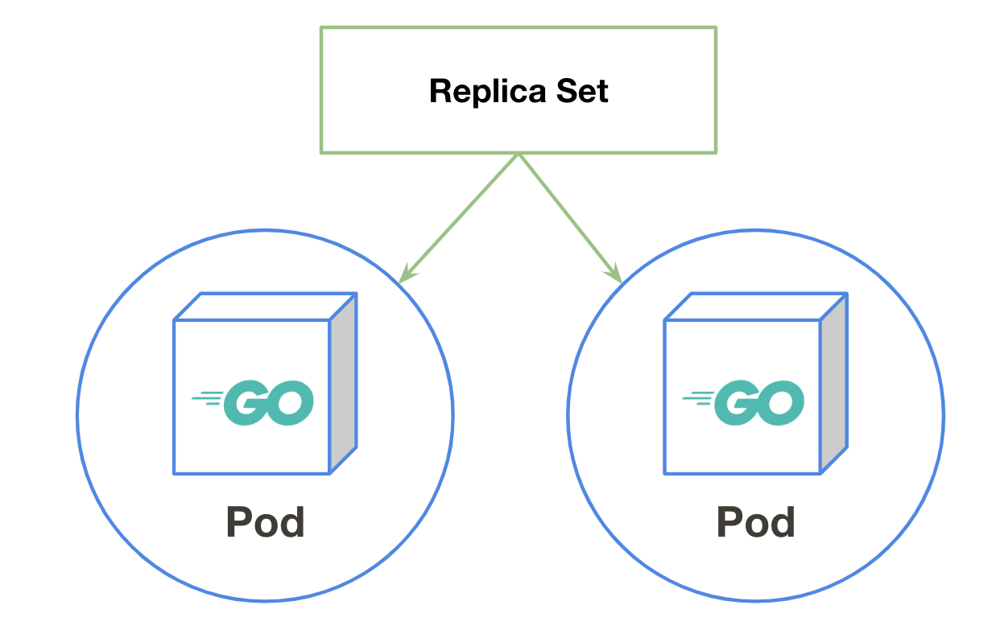

## ReplicaSetとは
Podの維持を行います。

Podを指定した台数になるようにコンテナの作成を行い、Podが落ちたときに自動復旧を行って指定された環境を維持し続けます。

## 動かしてみる
nginxイメージを2台動かしてみましょう

ReplicaSetは重要なObjectsの1つなのですが、CLIで作成できないためManifestで実行します。
```console
$ cat <<EOL | kubectl apply -f -
apiVersion: apps/v1
kind: ReplicaSet
metadata:
  name: mynginx
  labels:
    app: mynginx
spec:
  replicas: 2 # 起動したい台数を指定する
  selector:
    matchLabels:
      app: mynginx
  template:
    metadata:
      labels:
        app: mynginx
    spec:
      containers:
      - name: nginx
        image: nginx
EOL
```

ReplicaSetが作成されたかみてみましょう。  
`kubectl get` に `replicaset` を指定することで現在起動しているReplicaSetを閲覧することができます。

```console
$ kubectl get replicaset
NAME      DESIRED   CURRENT   READY   AGE
mynginx   2         2         2       17s
```

podが2台起動されているか確認してみましょう。  
```
$ kubectl get pods
NAME            READY   STATUS    RESTARTS   AGE
mynginx-4r56x   1/1     Running   0          107s
mynginx-p9tsk   1/1     Running   0          107s
```

## ReplicaSetの維持
ReplicaSetはPodの維持を行います。  
実際にPodを削除したときに自動復旧してくれるのか、台数（レプリカ数）を増やしたときに追従してくれるのか、実際に試してみましょう。

### 自動復旧
まずは自動復旧を試してみます。  

ReplicaSetで起動した2台のPodを確認します。
```console
$ kubectl get pods
NAME            READY   STATUS    RESTARTS   AGE
mynginx-4r56x   1/1     Running   0          4m46s
mynginx-p9tsk   1/1     Running   0          4m46s
```

`kubectl delete` コマンドでどちらかのPodを指定して削除します。
```console
$ kubectl delete pod mynginx-4r56x
pod "mynginx-4r56x" deleted
```

もう一度podの台数を確認してみましょう。  
2台Podが存在してAGE(生存時間)が新しいことが確認でき、自動的に2台コンテナが立ち上がったことがわかります。
```console
$ kubectl get pods
NAME            READY   STATUS    RESTARTS   AGE
mynginx-6rg8r   1/1     Running   0          14s
mynginx-p9tsk   1/1     Running   0          5m11s
```

### スケールアウト
Podを2台から3台にスケールアウトしてみましょう。

2台Podが存在することを確認します。
```console
$ kubectl get pods
NAME            READY   STATUS    RESTARTS   AGE
mynginx-6rg8r   1/1     Running   0          82m
mynginx-p9tsk   1/1     Running   0          87m
```

確認ができたら実際にスケールアウトしてみましょう。  
`kubectl scale` コマンドでReplicaSetと希望する台数を宣言します。
```console
$ kubectl scale --replicas=3 replicaset/mynginx
replicaset.extensions/mynginx scaled
```

3台になったことを確認できれば成功です。
```console
$ kubectl get pods
NAME            READY   STATUS    RESTARTS   AGE
mynginx-6rg8r   1/1     Running   0          82m
mynginx-p9tsk   1/1     Running   0          87m
mynginx-qs9js   1/1     Running   0          4s
```

## 片付け
```
$ kubectl delete replicaset mynginx
```
